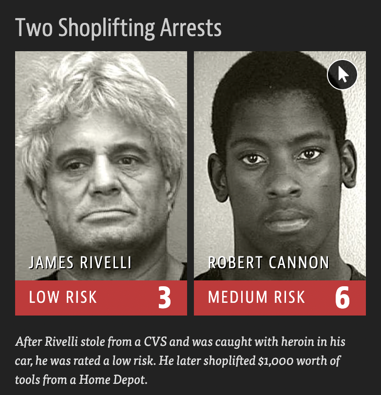
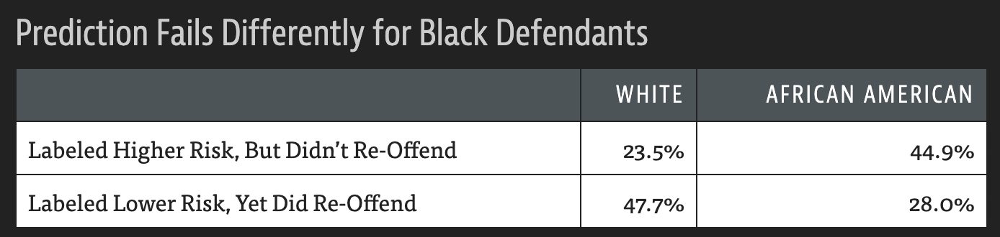
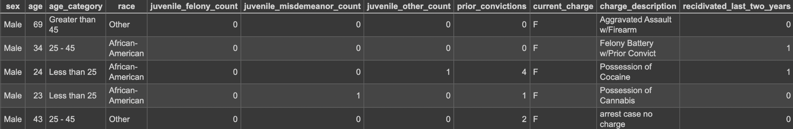
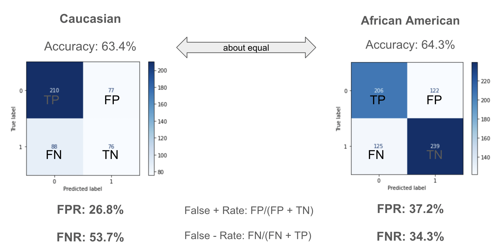
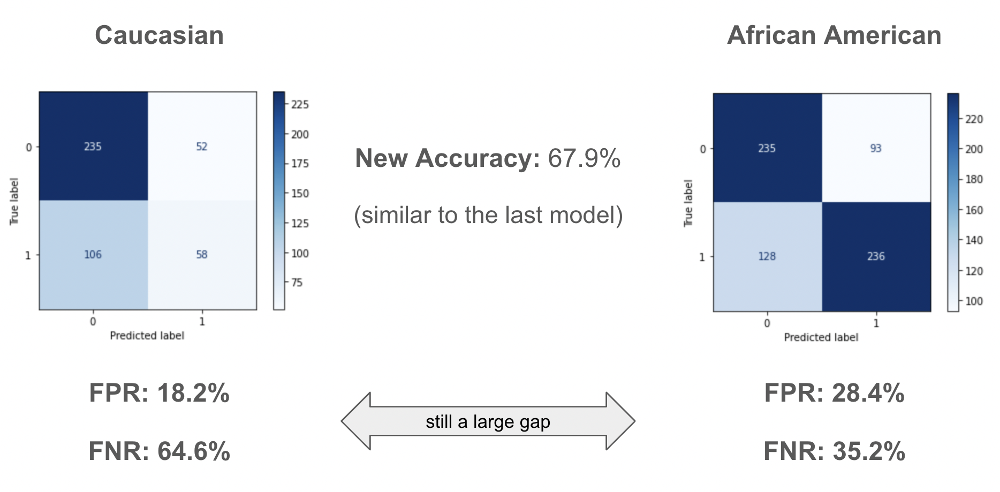

# Algorithmic Fairness Analysis of COMPAS Risk Assessment Tool
Correctional Offender Management Profiling for Alternative Sanctions (COMPAS) is an algorithmic risk-assessment tool used in U.S. courts to predict whether a defendant is likely to reoffend. It was intended to be less biased than human judges, but evidence shows it produces systematic racial disparities.

ProPublica found cases where defendants with similar charges received very different risk scores: white defendants with repeated offenses were often rated low risk, while Black defendants with fewer offenses were rated medium or high risk.

  
  

Statistically, this bias is clear: Black defendants were nearly twice as likely to be labeled “high risk” but not reoffend (44.9% vs. 23.5%). White defendants were more often labeled “low risk” yet did reoffend (47.7% vs. 28.0%). These unequal error rates are problematic because they affect bail, sentencing, and parole decisions, reinforcing existing racial inequities.

  

## COMPAS Dataset
This project uses the Broward County (FL) dataset, covering criminal defendants who underwent COMPAS assessments, to examine these patterns and explore definitions of fairness in AI models.

**Demographics**
- Predominantly Caucasian and African-American defendants  
- *Gender imbalance*: more than **4:1 ratio** of men to women

**Key Variables**
- 'prior_convictions': Number of prior convictions  
- 'current_charge': felony (**F**), misdemeanor (**M**), or other (**O**)
- 'charge_description': Description of the arrest charge  
- 'recidivated_last_two_years': Whether the defendant reoffended within two years (*prediction target*)

  

  

## Fairness in Machine Learning (fairness.py)

There are many ways to define fairness in machine learning.  
Here, we focus on **Group Fairness**.

### Group Fairness (Statistical Parity)

A classifier satisfies group fairness if all demographic groups are equally likely to be predicted as positive in a binary classification problem.

$$
P(\hat{y} = 1 \mid A = a) = P(\hat{y} = 1 \mid A = b)
$$
- $\hat{y}$ = model’s prediction  
- $A$ = sensitive attribute (e.g., race)  
- $a, b$ = different groups  

### Beyond Statistical Parity
We also examine **False Positive Rates (FPR)** and **False Negative Rates (FNR)** across groups, following the principle of *equal harm/benefit*.

## Results (model_eval.py)
### Model 1: Baseline
- Accuracy: ~63–64% across groups (similar)
- FPR (False Positive Rate): Higher for African-American defendants (37.2% vs. 26.8%)
- FNR (False Negative Rate): Higher for Caucasian defendants (53.7% vs. 34.3%)

  

### Model 2: Alternative Model (sans race)
Accuracy: 67.9% (slightly improved overall)
FPR Gap: Still large (18.2% vs. 28.4%)
FNR Gap: Caucasians still more likely to be misclassified as low-risk (64.6% vs. 35.2%)

  

**Takeaway: Even with improved accuracy, the disparity in error rates persists.**

## Conclusions
* Accuracy alone is misleading. While both groups had similar overall accuracy, error types (false positives/negatives) were unevenly distributed.
* Impact of imbalance: African-Americans were more likely to be labeled as high risk when they did not reoffend, while Caucasians were more likely to be labeled as low risk when they did reoffend.
* Fairness trade-offs: Improving one metric (e.g., lowering FPR for Caucasians) may worsen another (e.g., increasing FNR).
