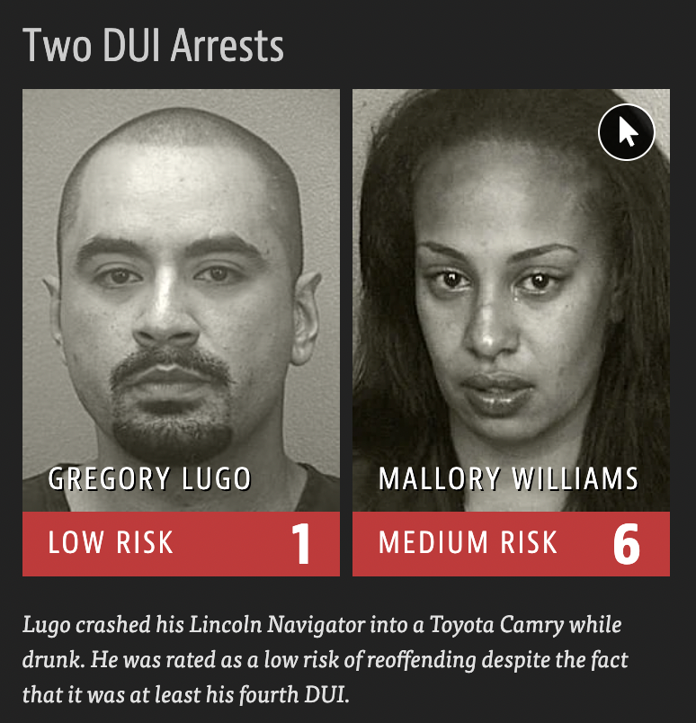

# COMPAS-case-study
COMPAS is an algorithmic risk-assessment tool used in U.S. jurisdictions (including New York, Wisconsin, California, and Broward County, FL) to predict whether a defendant is likely to reoffend (recidivate). The hope was that a machine learning model could be less biased than human judges, producing more equitable outcomes.

However, evidence suggests that COMPAS predictions may not be truly unbiased, raising critical questions about the fairness of algorithmic decision-making in the criminal justice system. This repository investigates those issues using the Broward County dataset, made public by ProPublica.

  
  

### 
